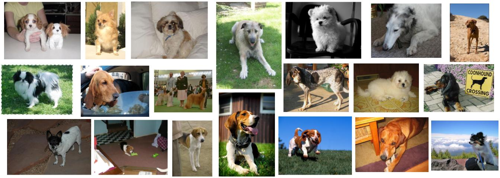

# ML that Can See: Supervised Learning with Images

In this week's tutorial, you will explore **transfer learning** using a pre-trained **ResNet18** model, training it to identify different breeds of dogs.  

This tutorial focuses on **PyTorch** for performing transfer learning with pretrained CNNs for **fine-grained image classification**.  

The learning goals of this tutorial are:

- Reading datasets from disk and **splitting them into train, validation, and test sets** using stratification.
- Performing **data preprocessing, augmentation, and loading**.
- Creating CNNs and **adapting their architecture for transfer learning**, specifically by freezing the backbone of pretrained CNNs.
- Building a **training loop** with loss, optimizer, and metrics.
- Observing **training behavior** and identifying overfitting.
- Evaluating the model on a **test dataset**.
- **(Bonus)** Performing **hyperparameter tuning** using Optuna.

This tutorial is designed as a **guided in-class activity**. However, if you wish, you can complete it independently by following the instructions below.

> **Dataset credit:**  
> Aditya Khosla, Nityananda Jayadevaprakash, Bangpeng Yao, and Li Fei-Fei. Novel dataset for Fine-Grained Image Categorization. First Workshop on Fine-Grained Visual Categorization (FGVC), IEEE Conference on Computer Vision and Pattern Recognition (CVPR), 2011.

---

## Instructions

This week we will train CNNs, so we recommend using the **IFQ680 GPU nodes**.  

To ensure all students have a chance to use a GPU node:
- At the end of the session, please select **File → Hub Control Panel → Stop My Server**.  
- If you don’t get a GPU node immediately, don’t worry — you can start with a standard IFQ680 node and check back later in the session.

Steps to get started:

1. Navigate to the **Week 3 tutorial notebook**.
2. Download the dataset ZIP file: `stanford_dogs_subset.zip`.
3. Upload the dataset ZIP into your Week 3 folder in the JupyterLab interface by clicking the **Upload File** icon on the left panel. This may take a few minutes; a progress bar will indicate loading.
4. Extract the ZIP file by **right-clicking** it and selecting **Extract Archive**. Give it a couple of minutes to complete.
5. Work through the **Week 3 tutorial notebook**.

---

## Tutorial Solution

- `IFQ680_Week3_Tutorial_Solution.ipynb`