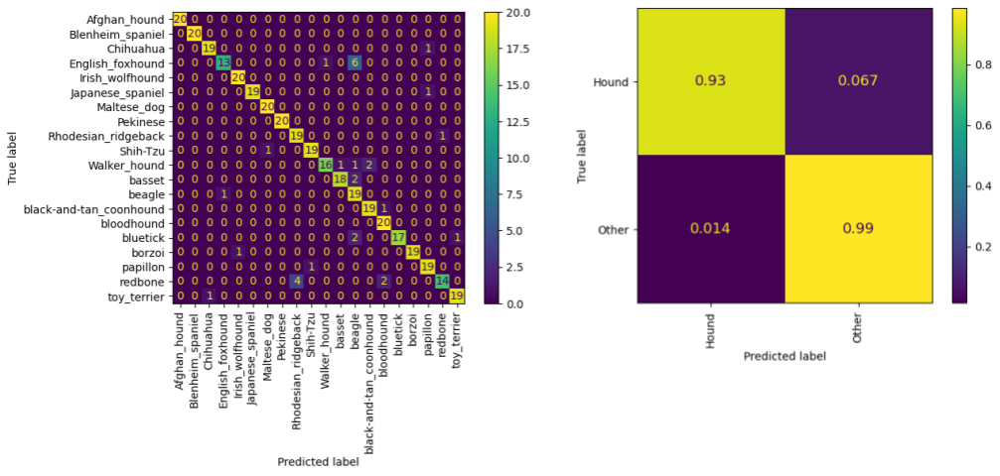

# Safety, Performance, Ethics

In this week's tutorial, we will explore different ways to summarise the performance of a classifier, beyond simple accuracy. We will continue working on the Stanford Dogs Subset dataset, using a ResNet18 trained in previous week tutorial.

The learning goals of this tutorial are:

- Making predictions on a test set.

- Understanding classification metrics, including:
    - Confusion matrices
    - Precision and recall
    - ROC curves
    - Confidence calibration curves

- Interpreting model predictions using **saliency methods**, specifically **Class Activation Mapping (CAM)**.

- Considering how to explain these concepts verbally to a non-expert.

This tutorial is a guided in-class activity! However, if you wish to complete on your own, you can follow the instructions below. 

> **Dataset credit:**  
> Aditya Khosla, Nityananda Jayadevaprakash, Bangpeng Yao, and Li Fei-Fei. Novel dataset for Fine-Grained Image Categorization. First Workshop on Fine-Grained Visual Categorization (FGVC), IEEE Conference on Computer Vision and Pattern Recognition (CVPR), 2011.

---

## Instructions

This week we will run inference using CNNs, so we recommend using the **IFQ680 GPU nodes**.  

To ensure all students have a chance to use a GPU node:
- At the end of the session, please select **File → Hub Control Panel → Stop My Server**.  
- If you don’t get a GPU node immediately, don’t worry — you can start with a standard IFQ680 node and check back later in the session.

Steps to get started:

1. Make sure you have completed the Week 3 tutorial, set up the dog breeds dataset, and saved the weights of your trained model, as these will be evaluated in this tutorial. 
2. Navigate to the **Week 4 tutorial notebook**.
2. Work through the Week **4 tutorial notebook**, following the instructions in each cell. 

---

## Tutorial Solution

- `IFQ680_Week4_Tutorial_Solution.ipynb`

