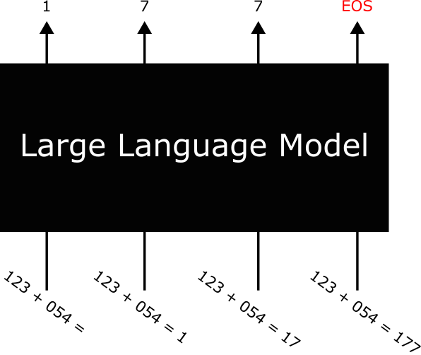

# Teaching a 'Large' Language Model to Perform Addition

In this week’s tutorial, we explore the power of large language models—the technology behind modern AI assistants such as ChatGPT. Specifically, we will train and evaluate a 'large' language model using the transformer architecture to learn how to perform addition.

    

 
Our goal is to explore how these models works in a manageable context. The learning goals of this tutorial are:

- Understanding tokenisation: what tokens and vocabularies are, and how to encode and decode sequences

- Generating synthetic data for training a model

- Applying positional encoding to represent sequence order

- Building a sequence-to-sequence transformer for prediction

- Implementing autoregressive prediction for step-by-step decoding

- Setting up training and validation loops

- Defining and computing evaluation metrics to monitor performance

This tutorial is designed as a guided in-class activity. However, if you prefer to complete it on your own, you can follow the instructions below. You are also encouraged to post questions on the tutorial discussion board if you are working independently.

## Instructions for the tutorial

1. Navigate to the Week 5 tutorial notebook by clicking [HERE].

2. Make sure you are running a GPU instance for this tutorial.

3. Work through the notebook step by step, following the instructions provided in each cell.

## Solution

`IFQ680_Week5_Tutorial-Solution.ipynb`