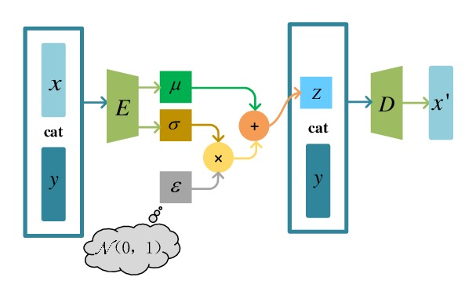

# Tutorial on Conditional Variational Autoencoder (CVAE)

This tutorial provides a hands-on exploration of Conditional Variational Autoencoder (CVAEs), covering model architecture, training, and applications. You will work through exercises that guide you to build, train, and use a CVAE for generating and manipulating MNIST digits. CVAE follows the architecture below, which we will implement from scratch in this tutorial.

    

 

**The learning goals of this tutorial are:**

- Understanding the architecture of a CVAE (encoder, decoder, latent space)

- Learning the reparameterization trick to enable end-to-end training

- Training a CVAE with reconstruction and KL divergence loss

- Generating new samples by controlling the latent vector and class condition

- Using the CVAE for classification via reconstruction error

This tutorial is a guided in-class activity! However, if you wish to complete on your own, you can follow the instructions below. You can also ask questions on the tutorial discussion board if you're completing this activity on your own.

## Instructions

1. Navigate to the Week 6 tutorial notebook by clicking [HERE]. Select 'IFN680 Notebook GPU' as your computing node.
2. Download the MNIST dataset ZIP file from [HERE]. 
3. Upload the dataset zip into your Week 6 folder in the jupyter lab tab. You can do this by clicking the 'upload file' icon on the left-hand screen of the jupyter lab environment. This may take a few minutes. There is a loading bar that will show progress.
4. Extract the zip file in the jupyter lab tab by right-clicking and selecting 'Extract archive'. Give this a couple of minutes.
5. Work through the Week 6 tutorial notebook, following instructions within the notebook. 
 
## Solution

IFQ680_Week6_Tutorial-Solution.ipynb