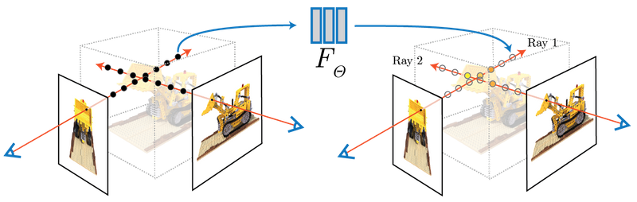
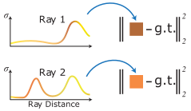

# Neural Radiance Fields (NeRF): A Minimal Implementation
Neural Radiance Fields (NeRF) introduced a powerful paradigm for 3D scene representation: instead of explicitly storing geometry (meshes, voxels, or point clouds), a scene is modeled as a continuous function parameterized by a neural network. Given a 3D coordinate and a viewing direction, this function predicts the volume density and emitted radiance at that location. By integrating these predictions along camera rays using differentiable volume rendering, we can synthesize photorealistic novel views of a scene.

      
    
<em>Figure: Neural Radiance Fields visualization obtained from https://www.matthewtancik.com/nerf</em>

In this tutorial, we will:
- Derive the core mathematical formulation behind NeRF.
- Explain volume rendering and its discretized implementation.
- Build a minimal NeRF model from scratch in Python.
- Implement ray sampling, positional encoding, and volumetric integration.
- Train the model on a simple synthetic dataset.
- Render novel views from the trained model.
- Evaluate the rendering quality.

The goal is clarity over complexity. We will intentionally implement a simplified NeRF to expose the essential components: coordinate encoding, the MLP architecture, ray marching, and differentiable rendering. By the end of this notebook, you will understand not just how to use NeRF — but how it works internally and how to implement it yourself.

## Instructions for the tutorial

1. Navigate to the Week 8 tutorial notebook by clicking [HERE].

2. Make sure you are running a GPU instance for this tutorial.

3. Work through the notebook step by step, following the instructions provided in each cell.

## Solution

`IFQ680_Week8_Tutorial-Solution.ipynb`